# Local Testing Guide: vodle with a Matrix Homeserver

This guide walks you through setting up a local Matrix homeserver
and testing the vodle app end-to-end in your browser — including
loading pre-built test polls with simulated voters.

---

## Prerequisites

You need the following installed on your machine:

- **Docker** (for running the Matrix homeserver)
- **Node.js** (v16+ recommended) and **npm**
- A modern browser (Chrome, Firefox, Edge)

---

## 1. Start a Local Matrix Homeserver (Synapse)

vodle uses the [Matrix protocol](https://matrix.org/) as its backend.
You need a homeserver running locally on port 8008.

### Option A: Using docker-compose (recommended)

The repository includes a ready-made config:

```bash
cd /path/to/vodle

# First time: generate the Synapse config
docker run --rm -v "$(pwd)/matrix-data:/data" \
  -e SYNAPSE_SERVER_NAME=localhost \
  -e SYNAPSE_REPORT_STATS=no \
  matrixdotorg/synapse:latest generate

# Enable guest-style registration (required for vodle login)
# Edit matrix-data/homeserver.yaml and add these lines:
#   enable_registration: true
#   enable_registration_without_verification: true

# Start the homeserver
docker compose -f docker-compose.matrix.yml up -d
```

### Option B: Using plain Docker

```bash
# 1. Generate config
docker run --rm -v /tmp/synapse-data:/data \
  -e SYNAPSE_SERVER_NAME=localhost \
  -e SYNAPSE_REPORT_STATS=no \
  matrixdotorg/synapse:latest generate

# 2. Enable registration in /tmp/synapse-data/homeserver.yaml:
#    enable_registration: true
#    enable_registration_without_verification: true

# 3. Start the homeserver
docker run -d --name synapse \
  -p 8008:8008 \
  -v /tmp/synapse-data:/data \
  matrixdotorg/synapse:latest
```

### Verify the homeserver is running

```bash
curl http://localhost:8008/_matrix/client/versions
```

You should see a JSON response listing supported Matrix versions.

---

## 2. Start the vodle Dev Server

```bash
cd /path/to/vodle

# Install dependencies
npm install

# Verify the Matrix backend is enabled (it is by default in dev)
# In src/environments/environment.ts, check:
#   useMatrixBackend: true
#   matrix.homeserver_url: "http://localhost:8008"

# Start the dev server
npx ng serve
# or: npm start
```

The app will be available at **http://localhost:4200**.

---

## 3. Log In

1. Open **http://localhost:4200** in your browser
2. Select your language (e.g. English), click **Next**
3. "Have you used vodle before?" → click **No**
4. Enter any email address (e.g. `test@example.com`)
5. Check the privacy consent checkbox
6. Click **Use guest account**

The app registers a guest account on your local Synapse homeserver
and takes you to the **My polls** page.

---

## 4. Load a Test Poll with Simulated Voters

The repository includes pre-built test polls in `couchdb/vodle/examples§*.json`.
The easiest way to load one is via a special URL.

### The TEST_50voters poll (recommended)

This poll simulates **50 voters** choosing among 5 ice cream flavours.
It gives you a realistic voting scenario with meaningful results.

**To load it**, navigate to this URL in your browser (while the app is running):

```
http://localhost:4200/#/draftpoll/use/%7B%22is_test%22%3Atrue%2C%22type%22%3A%22winner%22%2C%22language%22%3A%22en%22%2C%22title%22%3A%22Icecream%20flavour%20%28Large%20test%20poll%29%22%2C%22desc%22%3A%22What%20flavour%20should%20we%20buy%20for%20tonight%27s%20party%3F%20%28You%20and%2050%20simulated%20voters%29%22%2C%22due_type%22%3A%2210min%22%2C%22options%22%3A%5B%7B%22name%22%3A%22Vanilla%22%2C%22ratings%22%3A%5B55%2C53%2C100%2C100%2C100%2C100%2C0%2C0%2C18%2C19%2C100%2C100%2C52%2C17%2C0%2C100%2C100%2C100%2C100%2C0%2C0%2C100%2C0%2C100%2C54%2C0%2C100%2C0%2C100%2C100%2C100%2C100%2C54%2C52%2C100%2C100%2C100%2C100%2C100%2C100%2C100%2C55%2C15%2C0%2C0%2C100%2C100%2C0%2C0%2C0%5D%7D%2C%7B%22name%22%3A%22Chocolate%22%2C%22ratings%22%3A%5B56%2C53%2C0%2C0%2C20%2C56%2C100%2C0%2C0%2C52%2C100%2C0%2C0%2C0%2C100%2C57%2C52%2C0%2C0%2C100%2C0%2C100%2C21%2C0%2C20%2C100%2C100%2C100%2C0%2C0%2C55%2C100%2C100%2C0%2C100%2C23%2C100%2C53%2C53%2C0%2C19%2C54%2C0%2C55%2C55%2C100%2C52%2C0%2C100%2C100%5D%7D%2C%7B%22name%22%3A%22Strawberry%22%2C%22ratings%22%3A%5B55%2C0%2C8%2C52%2C100%2C52%2C0%2C100%2C100%2C0%2C100%2C6%2C54%2C8%2C100%2C100%2C54%2C52%2C0%2C51%2C0%2C10%2C0%2C51%2C51%2C6%2C5%2C100%2C0%2C100%2C54%2C53%2C100%2C0%2C55%2C10%2C0%2C6%2C0%2C55%2C55%2C51%2C50%2C54%2C53%2C9%2C55%2C51%2C100%2C52%5D%7D%2C%7B%22name%22%3A%22Lemon%22%2C%22ratings%22%3A%5B12%2C14%2C0%2C12%2C0%2C15%2C12%2C15%2C15%2C13%2C16%2C14%2C15%2C14%2C0%2C12%2C0%2C15%2C15%2C100%2C15%2C0%2C16%2C0%2C0%2C0%2C12%2C13%2C0%2C100%2C0%2C0%2C0%2C12%2C15%2C100%2C100%2C16%2C12%2C12%2C88%2C13%2C13%2C13%2C13%2C12%2C12%2C87%2C12%2C14%5D%7D%2C%7B%22name%22%3A%22Mango%22%2C%22ratings%22%3A%5B8%2C0%2C5%2C4%2C5%2C33%2C100%2C35%2C100%2C100%2C35%2C0%2C32%2C100%2C100%2C32%2C35%2C100%2C100%2C100%2C100%2C100%2C32%2C35%2C100%2C100%2C100%2C100%2C0%2C32%2C33%2C32%2C100%2C0%2C4%2C100%2C100%2C34%2C35%2C6%2C100%2C100%2C100%2C100%2C31%2C100%2C100%2C32%2C35%2C100%5D%7D%5D%7D
```

This URL uses the `draftpoll/use/:pd` route — the `:pd` parameter is
URL-encoded JSON matching the format in the example files.

### Other available test polls

| File | Description | Voters |
|------|-------------|--------|
| `examples§TEST_50voters.json` | Ice cream, 5 options, 50 simulated voters | 50 |
| `examples§TEST_icecream.json` | Ice cream, 5 options, corresponds to Heitzig & Simmons 2021 Fig. 2 | 4 |
| `examples§TEST_urlaub.json` | German-language vacation test poll | varies |

All test poll files are at `couchdb/vodle/examples§*.json` in the repo.

### Creating your own test poll URL

You can turn any JSON file into a `draftpoll/use` URL:

```bash
# Read the JSON, strip whitespace, URL-encode it
JSON=$(cat couchdb/vodle/examples§TEST_50voters.json | tr -d '\n' | python3 -c "import sys,urllib.parse; print(urllib.parse.quote(sys.stdin.read()))")

# Build the URL
echo "http://localhost:4200/#/draftpoll/use/$JSON"
```

Or manually: the JSON structure is:
```json
{
  "is_test": true,
  "type": "winner",
  "language": "en",
  "title": "My test poll",
  "desc": "Description",
  "due_type": "10min",
  "options": [
    {
      "name": "Option A",
      "ratings": [100, 50, 0]
    },
    {
      "name": "Option B",
      "ratings": [0, 50, 100]
    }
  ]
}
```

Key fields:
- **`is_test`**: must be `true` — this triggers the simulated voters
- **`type`**: `"winner"` (one option wins) or `"share"` (proportional allocation)
- **`due_type`**: `"10min"`, `"1h"`, `"1d"`, `"1w"`, `"custom"`
- **`ratings`**: array of simulated voter ratings (0–100) per option; the array
  length determines the number of simulated voters

---

## 5. Start the Poll and Vote

After loading the test poll, the draft editor opens:

1. Review the poll title, description, and options
2. Click **Ready** to go to the preview page
3. On the preview page, click **Start the poll now**
4. The app navigates to the **invite page** — you can skip this
5. Click **Go to poll** to reach the voting interface

### Voting interface

You will see:

- **5 WAP sliders** (one per option) — drag to set your willingness-to-approve
- **"51 non-abstaining"** counter — you plus the 50 simulated voters
- **Agreement percentage** — e.g. "77.7% agreement"

Try these things:

- **Change WAP values** — drag any slider to see the option reorder
- **Click "Assist me"** — opens a step-by-step wizard to guide your ratings
- **Click "live results"** — toggles Share and Approval columns showing
  current standings
- **Click the "waps" help link** — opens an explanation tooltip
- **Click an option name** — expands details about that option
- **Click "Add option"** — add a new option to the running poll

### Wait for results

The TEST_50voters poll uses `"due_type": "10min"`, so it ends 10 minutes
after starting. When the deadline passes:

1. The poll state changes from "running" to "closed"
2. The results page appears showing the winning option
3. You can see final approval percentages for all options

---

## 6. What Works and What Doesn't

| Feature | Without homeserver | With homeserver |
|---------|-------------------|-----------------|
| Login / registration | ✅ local guest (with error alert) | ✅ Matrix guest account |
| Navigate app | ✅ | ✅ |
| Create draft polls | ✅ | ✅ |
| Edit draft polls | ✅ | ✅ |
| Start poll (draft → running) | ⚠️ works locally but poll won't be visible to other users | ✅ |
| Load test polls with simulated voters | ✅ simulated voters register locally | ✅ |
| Vote (change WAPs) | ✅ local only | ✅ synced via Matrix |
| Assist wizard | ✅ | ✅ |
| Live results | ✅ | ✅ |
| Poll closes at deadline | ✅ | ✅ |
| Join poll via magic link | ❌ | ✅ |
| Multi-user real-time sync | ❌ | ✅ |
| Delegation | ❌ | ✅ |

---

## 7. Reverting to CouchDB Backend

If you prefer to test with the old CouchDB backend:

1. Edit `src/environments/environment.ts`
2. Set `useMatrixBackend: false`
3. Start a CouchDB server at `localhost:5984`
4. Restart the dev server (`npx ng serve`)

---

## 8. Troubleshooting

### "Cannot connect to Matrix server" alert on login

The homeserver is not reachable at `http://localhost:8008`.

- Check that Synapse is running: `docker ps | grep synapse`
- Check the port: `curl http://localhost:8008/_matrix/client/versions`
- Check `homeserver.yaml` has registration enabled

### Synapse container exits immediately

Usually a config issue. Check logs:
```bash
docker logs vodle-matrix-synapse
```

Common fixes:
- Regenerate config (re-run the `generate` command)
- Ensure `matrix-data/` directory exists and is writable

### Poll starts but simulated voters don't appear

Make sure the JSON has `"is_test": true`. Without this flag,
no simulated voters are registered.

### "Start the poll now" button is disabled

The poll's due date is in the past. Use a `due_type` of `"10min"` or later,
or re-load the test poll URL to generate a fresh draft with a future deadline.

---

## 9. Screenshots from Automated E2E Testing

The following screenshots were taken during automated end-to-end testing
with a real Synapse homeserver running locally in Docker. They document
the full poll lifecycle using the TEST_50voters example.

### Login flow (without homeserver — graceful degradation)

| Screenshot | Description |
|-----------|-------------|
|  | Welcome screen with language selection |
| 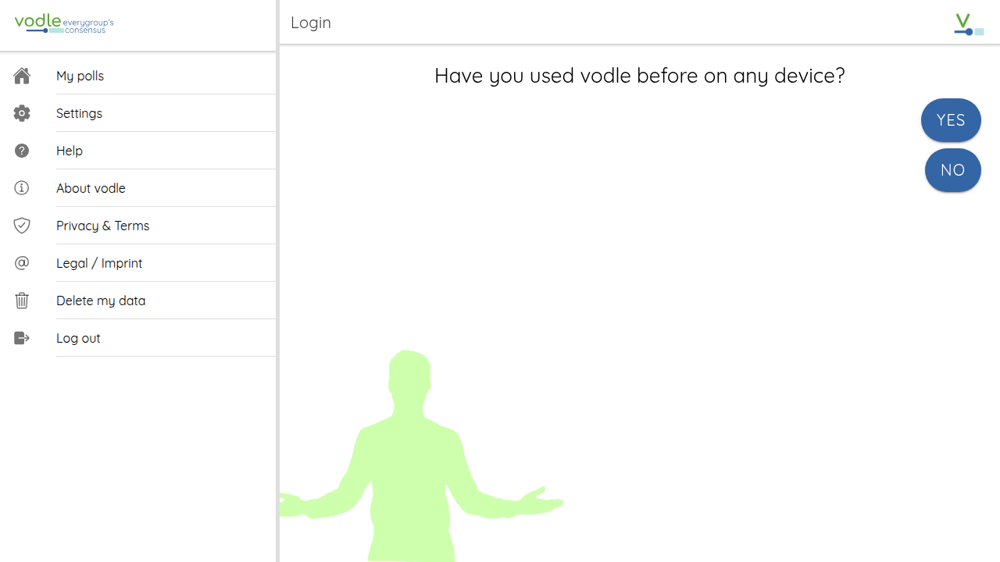 | "Have you used vodle before?" |
| 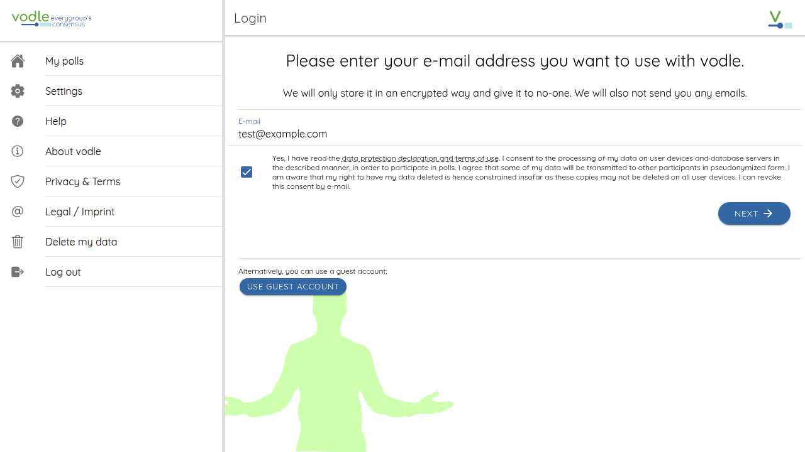 | Email entry with consent checkbox |
| 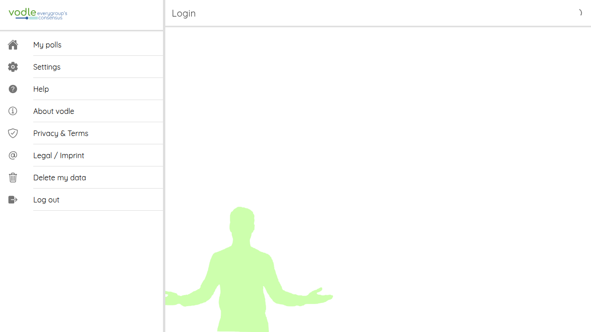 | Matrix error alert (handled gracefully) |
| 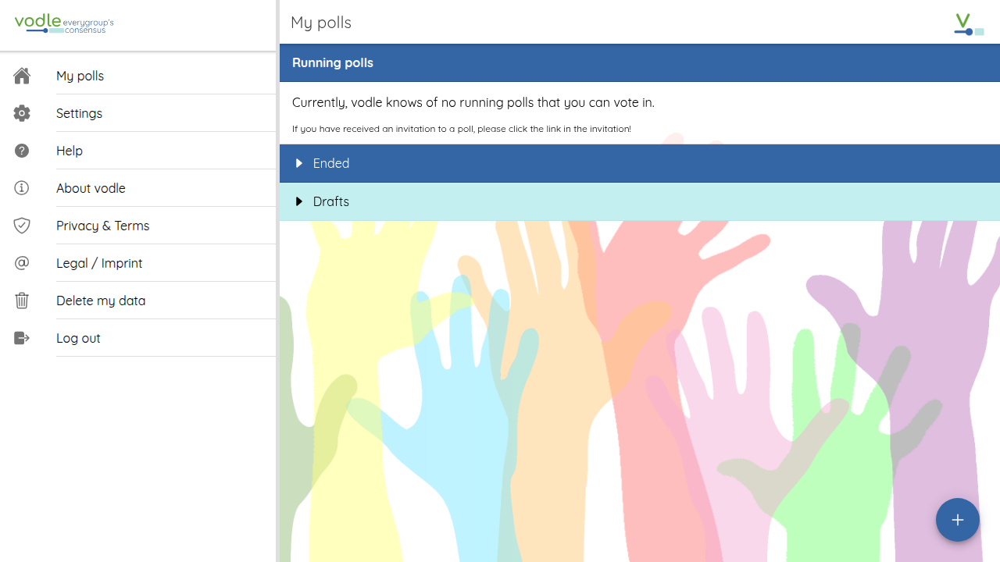 | "My polls" page after dismissing error |

### Draft poll creation (without homeserver)

| Screenshot | Description |
|-----------|-------------|
| 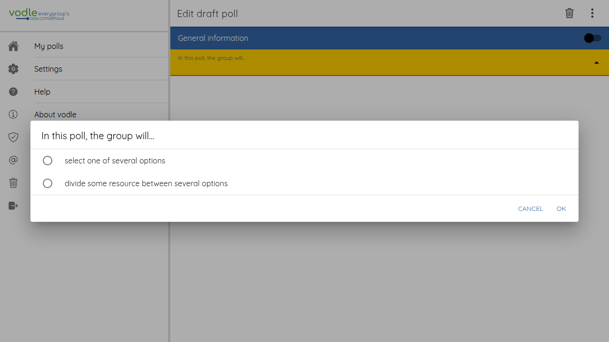 | Poll type selection dialog |
| 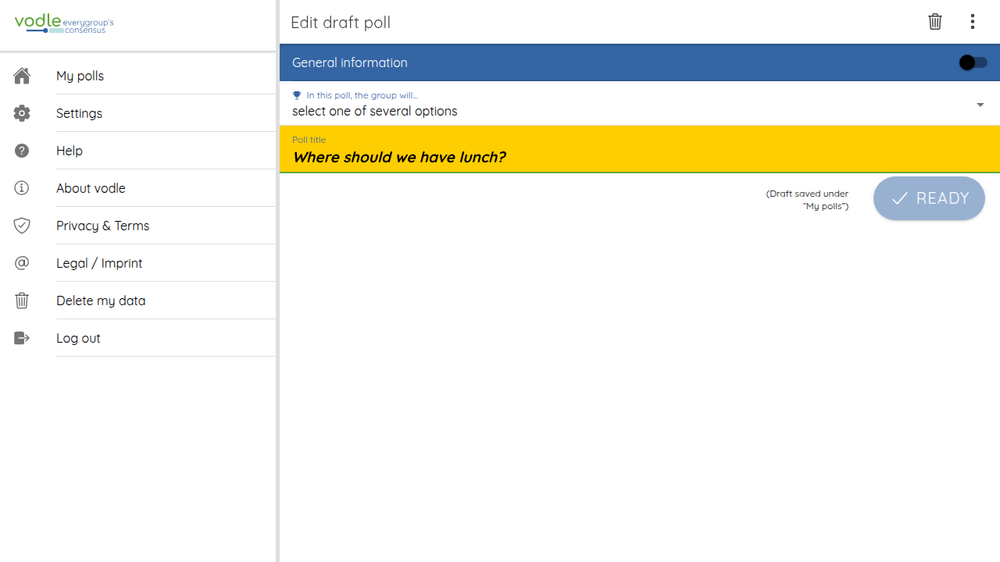 | Draft poll editor |

### Full lifecycle with Matrix homeserver

| Screenshot | Description |
|-----------|-------------|
| 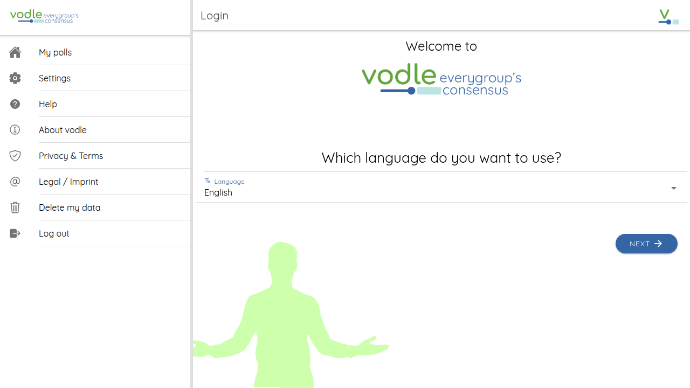 | Login page (Matrix connected) |
| 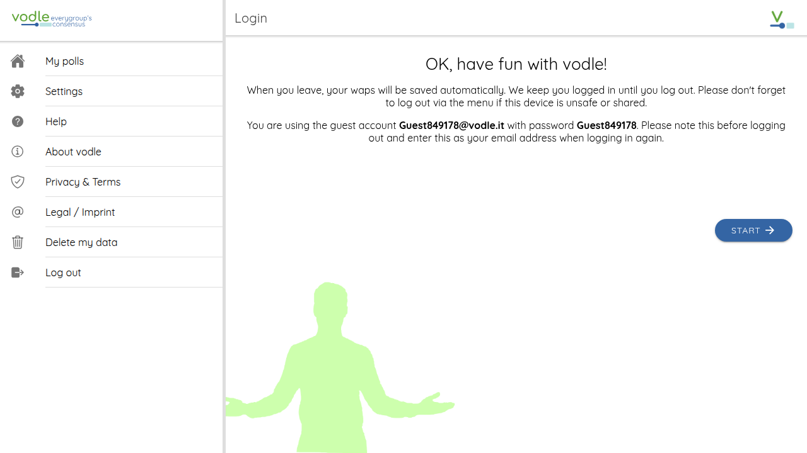 | Successful Matrix guest registration |
| 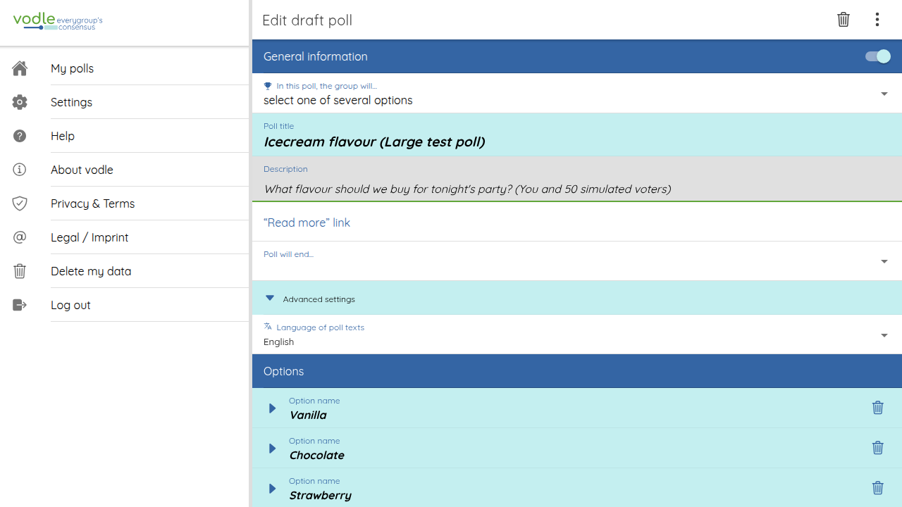 | Draft poll with TEST_50voters data |
| 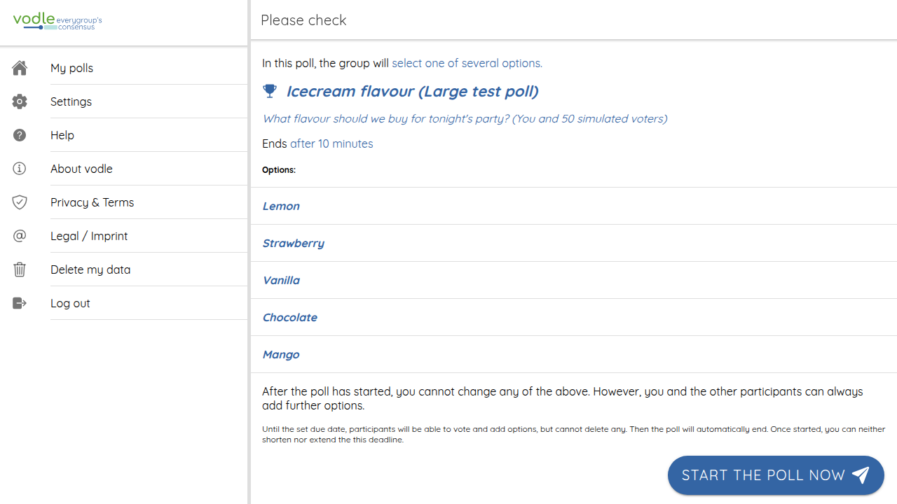 | Preview page — ready to start |
| 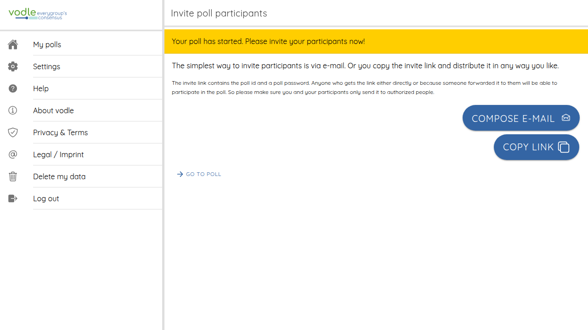 | Invite page after starting (Matrix magic links) |
| 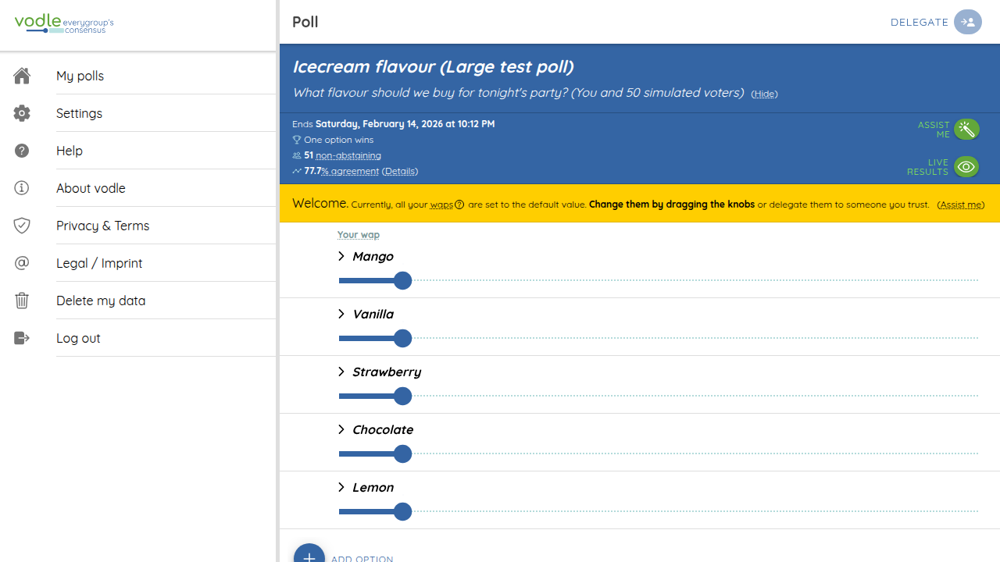 | Voting interface: 51 voters, 77.7% agreement |
| 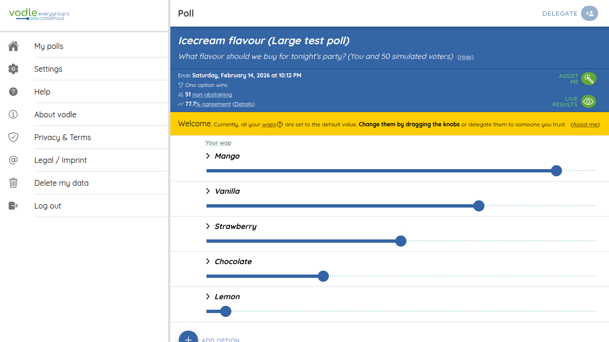 | WAP sliders adjusted (Mango 90, Vanilla 70, Strawberry 50, Chocolate 30, Lemon 5) |
| 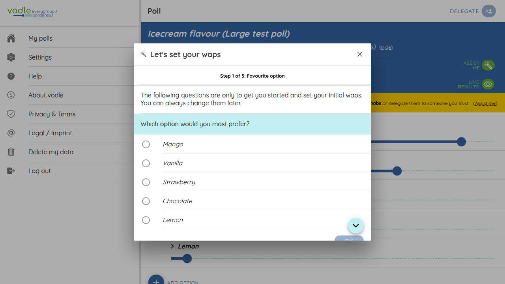 | "Assist me" wizard — Step 1 of 5 |
| 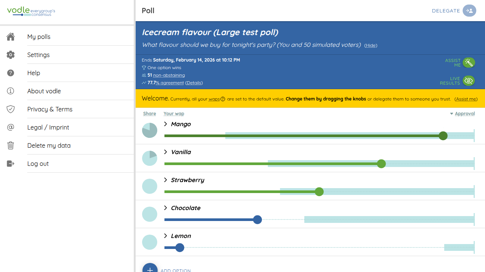 | Live results with Share and Approval columns |

---

## Architecture Notes

### Data flow with Matrix backend

```
User Action → DataService → if (useMatrixBackend) → MatrixService → Synapse
                                                  ↘ Local cache (always updated synchronously)
```

- **Local cache** is always updated synchronously for fast UI
- **Matrix sync** is fire-and-forget with `.catch()` error logging
- If the homeserver is down, local operations still work; remote sync fails silently

### Key environment settings

| Setting | Dev (`environment.ts`) | Prod (`environment.prod.ts`) |
|---------|----------------------|----------------------------|
| `useMatrixBackend` | `true` | `false` |
| `matrix.homeserver_url` | `http://localhost:8008` | (to be configured) |
| `matrix.enable_e2ee` | `true` | `true` |
